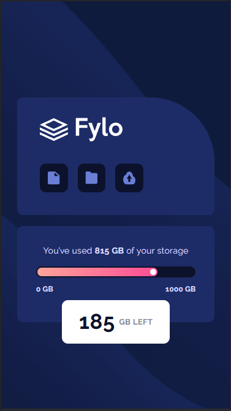
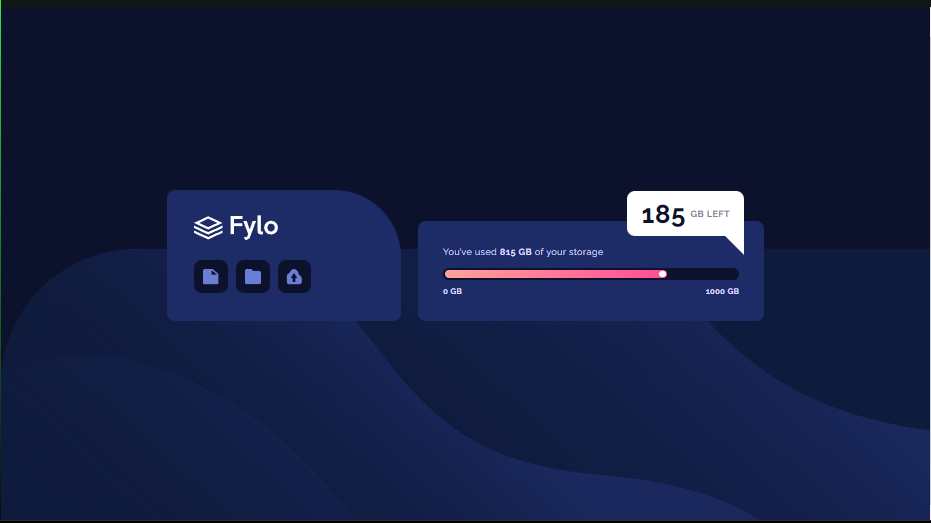

# Frontend Mentor - Fylo data storage component solution

This is a solution to the [Fylo data storage component challenge on Frontend Mentor](https://www.frontendmentor.io/challenges/fylo-data-storage-component-1dZPRbV5n). Frontend Mentor challenges help you improve your coding skills by building realistic projects. 

## Table of contents

- [Overview](#overview)
  - [The challenge](#the-challenge)
  - [Screenshot](#screenshot)
  - [Links](#links)
- [My process](#my-process)
  - [Built with](#built-with)
  - [What I learned](#what-i-learned)
- [Author](#author)

## Overview

### The challenge

Users should be able to:

- View the optimal layout for the site depending on their device's screen size

### Screenshot

 

### Links

- Solution URL: [https://github.com/NugyTomas/Fylo-data-storage-component]
- Live Site URL: [Add live site URL here](https://your-live-site-url.com)

## My process

### Built with

- Semantic HTML5 markup
- Flexbox
- CSS Grid
- Mobile-first workflow

### What I learned

This was probably the most complex challenge I have donne so far. I had to learn about  clip-path and :before to make that little triangle to make the "bubble" for desktop view. This was an amazing challenge! 

## Author

- Website - [https://github.com/NugyTomas]
- Frontend Mentor - [https://www.frontendmentor.io/profile/NugyTomas]

